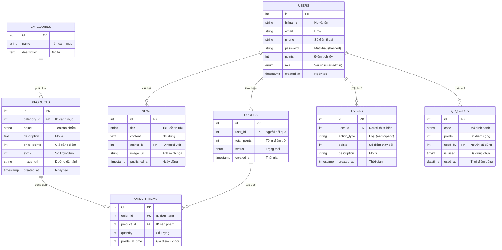

# Mô hình ERD - Green Credit Platform (8 Tables)

Dưới đây là sơ đồ quan hệ thực thể (ERD) chi tiết cho hệ thống Green Credit với đầy đủ 8 bảng.

## 1. Sơ đồ Mermaid

## 2. Chi tiết các mối quan hệ

- **Danh mục và Sản phẩm (1-N):** Một danh mục có thể chứa nhiều sản phẩm.
- **Người dùng và Đơn hàng (1-N):** Một người dùng có thể thực hiện nhiều lần đổi quà.
- **Đơn hàng và Chi tiết đơn hàng (1-N):** Một đơn hàng bao gồm nhiều sản phẩm khác nhau.
- **Sản phẩm và Chi tiết đơn hàng (1-N):** Một sản phẩm có thể xuất hiện trong nhiều đơn hàng khác nhau.
- **Người dùng và QR Code (1-N):** Một người dùng có thể quét nhiều mã QR khác nhau để tích điểm.
- **Người dùng và Tin tức (1-N):** Một Admin có thể viết nhiều bài tin tức.
- **Người dùng và Lịch sử (1-N):** Mọi giao dịch điểm đều được lưu vết chi tiết.

---
*Tài liệu được cập nhật để khớp với Database thực tế.*
